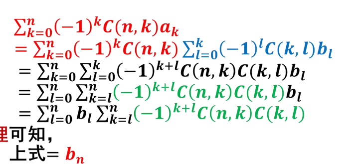

# 容斥原理与鸽巢原理

## 3.1 容斥原理引论

主要研究有限集合的交或者并的计数

$$
\subset \ \cup\ \cap
$$
### DeMorgan定理

$\overline A \cup \overline B = \overline{A\cap B}$

$\overline A \cap \overline B = \overline{A\cup B}$

### 广义DeMorgan定理

$\overline{A_1\cup\cdots\cup A_n} = \overline A_1\cap \cdots \cap \overline A_n$

$\overline{A_1\cap\cdots\cap A_n} = \overline A_1\cup \cdots \cup \overline A_n$

## 3.2 容斥原理

主要研究有限集合并的计数

$|A\cup B| = |A|+|B| -|A\cap B|$

广义：对n个有限集合

$|A_1 \cup \cdots \cup A_n| = |A_1|+\cdots +| A_n|-(|A_1\cap A_2|+\cdots ) +(|A_1\cap A_2\cap A_3|+\cdots )$

- 用归纳法证明

### 3.3 容斥原理基本举例

例题1：a, b, c ,d ,e, f的全排列中不允许出现ace和df的图像的排列数

例题2：不超过120的素数的个数

## 3.4 再谈错排

根据DeMorgan定律$\overline{A_1\cup\cdots\cup A_n} = \overline A_1\cap \cdots \cap \overline A_n$

或者按照错排的元素个数进行枚举

得到

$D_n = n!(1-\frac 1{1!} +\frac 1{2!}+ +(-1)^n\frac 1{n!})$

稍进一步，对于特定元素的错排

例题：对于8个字母$ABCDEFGH$的全排列中，求使得$A,C,E,G$四个字母不在原来位置上的错排数目

## 3.5 棋盘多项式与有限制排列

基本表示：

对于$5\times 5$的棋盘41352: 第一行位于第四列，类推

并可推广至任意形状

定义1：设C为一棋盘，则称$R(C) = \sum_{k=0}^\infty r_k(C)x^k$为C的棋盘多项式

并规定$r_0(C) =1$包括C为空集时的状态

此时令$C_i$为某一个格子去掉行列所在的棋盘，$C_e$为原棋盘此位置不放子，

显然有$r_k(C) = r_{k-1}(C_i)+r_k(C_e)$

于是有了$R(C)=xR(C_i)+R(C_e)$

并且对于相互棋盘C由相互分离的$C_1，C_2$两部分组成，则

$R(C) = R(C_1)R(C_2)$

对于有禁区的排列

定理：$r_i$为$i$个棋子步入禁区的方案数，$i=1,2,3,\cdots,n$，有禁区的布子方案数为

$r_0n!-r_1(n-1)!+r_2(n-2)!+\cdots+(-1)^nr_n$

- 证明

  令$A_i$为第$i$个妻子步入禁区，其他棋子任意的方案

  则所有棋子都不步入进去的方案数为

  $|\overline A_1 \cap\overline A_2\cap\cdots \cap \overline A_n|= N-|A_1\cup A_2\cup\cdots \cup A_n|=N-(|A_1|-|A_2|\cdots |A_n|)+\cdots$

   $= n!+\sum^n_{k=0}r_k(n-k)!$

  计算，确定$r_1,r_2\cdots,r_n\to R(c)$

三论错排

错排问题显然是禁区为对角线上的元素

$R(C)  = \sum^n_{k=0}C(n,k)x^i$

代入公式即：$n!-\frac{n}{1！}(n-1)!+\frac{n(n-1)}{2!}\times(n-2)！+\cdots \\= n!(1-\frac{1}{1!}+\frac{1}{2!}+(-1)^n\frac{1}{n!})$

## 3.6 广义的容斥原理

- 容斥原理的推广
  - 只选一个？
  - 相对补集

**一般公式**

前提：在集合$S$上讨论不同性质形成的子集$A_1,\cdots ,A_n,$假定$0\le m \le n$

有$\alpha(m)=^\Delta= \sum|A_{i_1}|$

例题：$n$对夫妻围圈而坐，每对夫妻都相邻的方案有多少$\frac{n!}{n}2^n$

引申：$n$对夫妻围圈而坐, 每个男人都不和他的妻子相邻有多少种可能的方案

- 重点

  主要是$2^n$

再引申：$n$对夫妻围圈而坐，男女相间，每个男人不和他的妻子相邻，有多少种可能的解决方案？

例题：线性方程$x_1+x_2+x_3=15,满足：0\le x_1\le 5,0\le x_2\le 6,0\le x_3 \le 7$

解法1：变换成无限制的非负数即可

解法2：容斥原理：令$A_i$为变量$x_i$不满足限制条件的解集

则有：$|\overline A_1\cap \overline A_2 \cap\overline A_3| = C(3+15-1,15)-|A_1|-|A_2|-|A_3|+\cdots$

其中$|A_1| =(y_1+6+x_2+x_3)\to C(3+9-1,9)=55$

## 3.7 Mobius反演

- 基本思想：$\{a_n\}$ 易算，$\{b_n\}$不易算，$\{a_n\}$ 可用$\{b_n\}$表示，利用反演，将$\{b_n\}$用$\{a_n\}$表示

1. 二项式反演

   - 引理：$\sum^n_{k=m}(-1)^{m+k}C(n,k)C(k,m)=
     \begin{cases}
     1 ,m=n\\
     0,m < n \\
     \end{cases}$

       - 证明$C(n,k)C(m,k)=C(n,m)C(n-m,k-m)$

         易得，转换一下就行

   - 定理$a_n=\sum^n_{k=0}(-1)^kC(n,k)b^k\Leftrightarrow b_n = \sum^n_{k=0}(-1)^kC(n,k)a^k$

     - 代数证明：

       

       - 第一次变换：

         两个求和号交换。矩阵加法（有限的），行列交换

         下三角矩阵的求和，（脑子里想一下）

       - 第二次变换：引理

       对称性反之显然

     - 容斥原理证明：

       设集合中具有此性质的集合分别是$A_i$

       则不具有次性质的集合为：

       TODO

   - 推论，$a_n=\sum^n_{k=0}C(n,k)b^k\Leftrightarrow b_n = \sum^n_{k=0}(-1)^{n-k}C(n,k)a^k$

     - 证明

       $b_k$使用$(-1)^kb_k$代入即可

2. 第四次错排

   - 解：

     $A_k$表示恰好$k$个位置保持不变，$D_k$,恰好$k$个位置错排

     则有$n! = \sum^n_{k=0}C(n,k)|A_k| = \sum^n_{k=0}C(n,k)D_{n-k}$

     令$n-k=l$则上式子变为

     $n！=\sum^n_{l=0}c(n,l)D_l$

3. $Mobius$反演

   定义$\mu(n) = \begin{cases} 
   1 , \qquad if: n=1\\
   0 , \qquad \exists i,s.t.\alpha_i>1\\
   (-1)^k, \qquad \alpha_i=1,i = 1,2,3,\cdots k
   \end{cases}$

   定理3-7-11对于任意正整数$n$，

   有$\sum_{d|n}\mu(d)=\begin{cases} 
   1 \qquad if: n=1\\ 0 \qquad if:n>1
   \end {cases}$

   - 证明

     $\sum_{d|n}\mu(d) = \sum_{d|n_1}\mu(d)=\mu(1)+\sum^k_{j=1}\sum_{l\in T(k,j)}\mu\left( \prod_{i\in l}p_i  \right) = \\1+\sum^k_{j=1}C(k,j)(-1)^j=0$

     取j个因子，找到所有组合，即是二项式系数

   定理3-7-2 $Mobius$反演定理：对于$f(n) 和g(n)$定义在正整结合上的两个函数若$f(n)=\sum_{d|n}g(d) 则g(n)=\sum_{d|n}\mu(d)f(\frac nd)$, 反之亦然

## 3.8 鸽巢原理

- 若有$n$个鸽子巢，$n+1$个鸽子，则至少有一个巢内有至少两个鸽子

例题：

17-7设$a_1,a_2,a_3$为任意的3个整数，$b_1b_2b_3$为$a_1,a_2,a_3$的任意排列，则$a_1-b_1,a_2-b_2,a_3-b_3$至少有一个是偶数

- 解答

  三个数中必有两个同奇偶，假设这三个数被2除的余数为$xxy$，于是$b_1,b_2,b_3$中被2除的余数有两个x，一个y，则被2除的余数必有一个数是零

$X$为$9$个正整数的集合，$E\subseteq X,S(E)$为集合$E$的元素的和，n是$X$的元素的最大值，求$n$的值，使得$X$至少存在两个集合$A和B$使得$S(A) = S(B)$

## 3.9 Ramsey问题

- eg : $6$个人中至少存在 $3$人相互认识或相互不认识
  - $K_6$的边$2$着色，必存在同色三角形
  - 推论：
    1. $K_6$的边用红蓝任意着色，至少有两个同色的三角形
    2. $K_9$的边红蓝任意着色，则必有红$K_4$或蓝三角形（蓝$K_4$或红三角形）
    3. $K_{18}$的边红蓝$2$着色，比存在红$K_4$或蓝$K_4$

## 3.10 Ramsey数

给定一对正整数$a,b$ 存在一个最小的正整数$r$，对$r$个顶点的完全图任意红蓝$2$着色，存在$a$个顶点的红边完全图**或**$b$个顶点的蓝边完全图，记为$r(a,b)$

则有：$r(3,3) = 6, \ \qquad r(3,4)=9,\qquad r(4,4)=18$

- 简单性质

  - $r(a,b) = r(b,a)$

  - $r(a,2)=r(2,a) = a$

  - 对$\forall a,b\ge2,r(a,b) \exists$

  - $r(a,b)\le r(a-1,b)+r(a,b-1)$

    - 证明

      $d_r(v)+d_b(v)=r(a-1,b)+r(a,b-1)-1$ 

      决策树判定

  - $r(a,b) \le C(a+b-2,\ a-1)$

    - 数学归纳法

- $Ramsey$数推广

  - $k$着色
  - $r(a_1,a_2,\cdots,a_n)\le r(a_1,r(a_2,\cdots,a_n))$
    - 满足的最小数$\le$某种情况